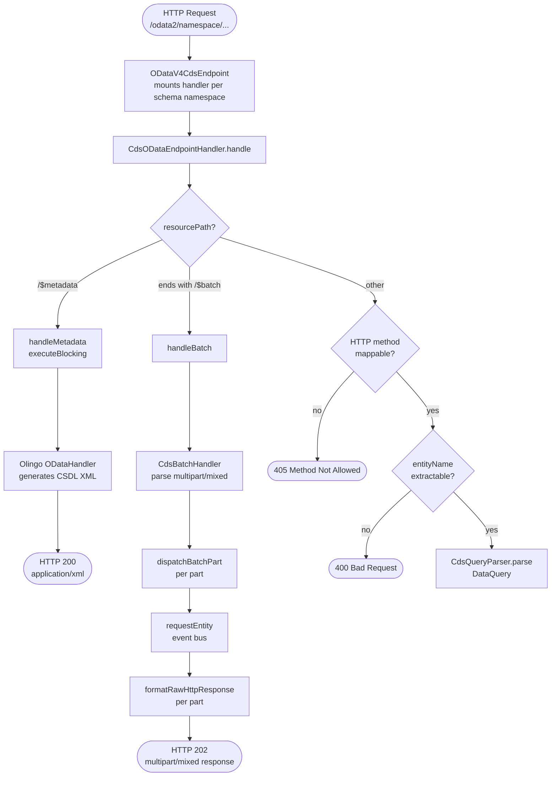
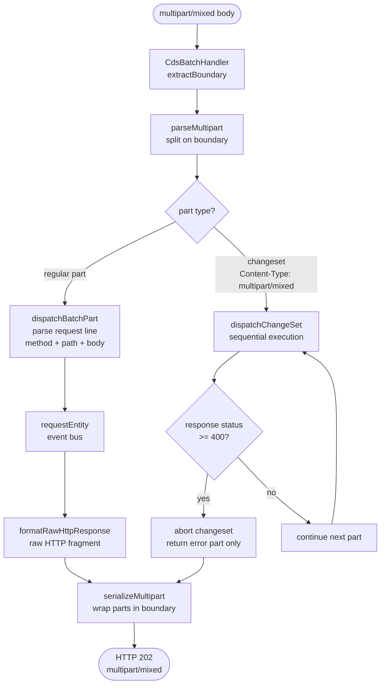
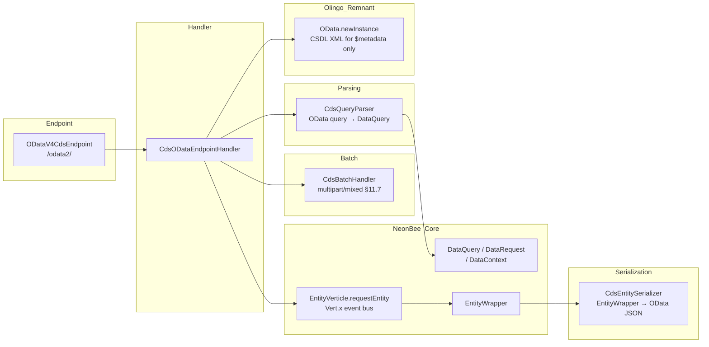

# CDS-Native OData V4 Endpoint — Flow Diagram

Overview of how an HTTP request is processed by `ODataV4CdsEndpoint` (`/odata2/`).

## Request Routing



## Data Dispatch & Response

```mermaid
flowchart TD
    R[DataQuery + DataRequest\nFQN = namespace.EntityName] --> S[EntityVerticle.requestEntity\nVert.x event bus]

    S -- failure --> T[sendErrorResponse\nOData JSON error]
    T --> U([HTTP 500\napplication/json])

    S -- success --> V[transferResponseHint\ncopy DataContext hints\nto RoutingContext]
    V --> W{isCountRequest?}

    W -- "yes\n/$count" --> X[resolveCount\nfrom hint or entity list size]
    X --> Y([HTTP 200\ntext/plain integer])

    W -- "no" --> Z{action?}

    Z -- "DELETE\nor empty UPDATE" --> AA([HTTP 204 No Content])

    Z -- "other" --> AB{isSingleEntity?\npath has key predicate}

    AB -- "yes\nor single result\nfrom CREATE/UPDATE" --> AC[CdsEntitySerializer\n.serializeEntity\n@odata.context /$entity]
    AC --> AD([HTTP 200/201\napplication/json\nodata.metadata=minimal])

    AB -- "no\ncollection" --> AE[resolveInlineCount\nfrom response hint]
    AE --> AF[CdsEntitySerializer\n.serializeCollection\n@odata.context + value array]
    AF --> AG([HTTP 200\napplication/json\nodata.metadata=minimal])
```

## $batch Part Dispatch



## Component Overview



## Key Design Decisions

| Concern | Decision |
|---|---|
| `$metadata` | Delegates to Olingo via `executeBlocking` — only remaining Olingo usage |
| All data requests | Event loop only — no `executeBlocking` |
| FQN resolution | Built from `schemaNamespace + "." + extractEntityName(resourcePath)` — `NormalizedUri.fullQualifiedName` is always null for paths starting with `/` |
| Response format | `application/json;odata.metadata=minimal` with `@odata.context`, `@odata.count`, `value` envelope |
| Batch | Multipart/mixed per OData V4 §11.7; changesets abort on first 4xx/5xx |
| Response hints | `EntityVerticle` signals applied query options via `DataContext.responseData()`; copied to `RoutingContext` under `response.` prefix |
